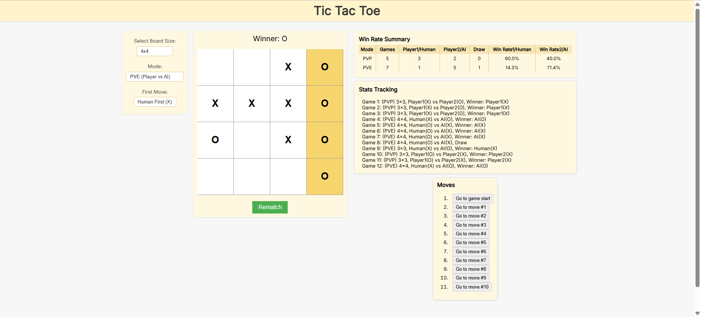

# 🧠 Tic-Tac-Toe – Enhanced React Implementation

This project is a responsive and interactive implementation of the classic Tic-Tac-Toe game using **React**. It includes key features such as dynamic board size selection, move history, and win/draw detection.

Developed by **Zhu Kuangyun** from INSA Lyon as a front-end response for a technical stage application.

---

## 🚀 Preview

### 📌 Initial State


### 🕹️ In-Game Example



---

## ✨ Features

### ✅ Existing Core Features

- **Two-player mode** with turn-based logic.
- **Victory detection** with winning line highlight.
- **Draw detection** when the board is full with no winner.
- **Rematch button** for quick restarts.
- **Game history tracker** with move-by-move replay.
- **Custom board size support**: choose from 3×3, 4×4, 5×5 … up to 8×8.
- **Responsive UI** with clear layout and improved visuals.
- **Board scaling and styling** for different sizes.
- **Statistics tracking** with full past results listed.

### 🆕 May 15 Additions

- **PVE Mode (Player vs AI)**: Added an AI opponent with local decision-making logic.
- **First-Move Selection**: Users can choose who plays first in both PVP and PVE modes.
- **Win Rate Summary Table**: Tracks wins/losses/draws and calculates win rates by mode and player.
- **Grid-Based Board Layout**: Rebuilt using CSS Grid for clean, consistent layout at all board sizes.
- **Enhanced UI Structure**: Settings, board, and history are now cleanly separated and responsive.

---

## 🛠️ Development Process

This project was built using an iterative, goal-driven approach: each feature was scoped, implemented, tested, and committed before moving on.

### 📌 Initial Development Steps

1. Initial interactive board and basic game logic.
2. Win detection and visual highlighting.
3. Draw condition and reset mechanism.
4. Move history with time-travel feature.
5. Persistent statistics tracking.
6. Dynamic board resizing logic.
7. Responsive design and visual polish.

### 🆕 May 15 Additions

8. Added PVE mode with adjustable first-move settings.
9. Developed basic AI logic (win > block > random).
10. Created win rate summary table for mode/player tracking.
11. Refactored board to use CSS Grid, preserving structure across sizes.
12. Reorganized UI into clear left–center–right layout, with win/stats info below.

---

## 🔧 Tools & Technologies

| Tool            | Purpose                              |
|-----------------|--------------------------------------|
| React + Vite    | Lightweight, fast front-end development |
| VS Code         | Main development IDE                |
| Git & GitHub    | Version control and collaboration   |
| GitHub Copilot  | Code suggestions and boilerplate    |
| ChatGPT         | Debugging and architecture assistance |

> **Note**: Copilot and ChatGPT were used as development assistants, not replacements. All logic, structure, and integrations were independently planned and implemented.

---

## 📦 Installation & Usage

Follow these steps to set up and run the project locally:

```bash
# 1. Clone the repository
git clone https://github.com/NuageZHU/Tic-Tac-Toe.git
cd Tic-Tac-Toe

# 2. Install dependencies
npm install

# 3. Start the development server
npm run dev

# Open your browser at http://localhost:5173 to enjoy the game.
```

---

## 🤝 Contributing

Contributions are welcome! If you have suggestions or improvements, feel free to fork the repository and submit a pull request.

---

## 📜 License

This project is licensed under the MIT License. See the [LICENSE](./LICENSE) file for details.