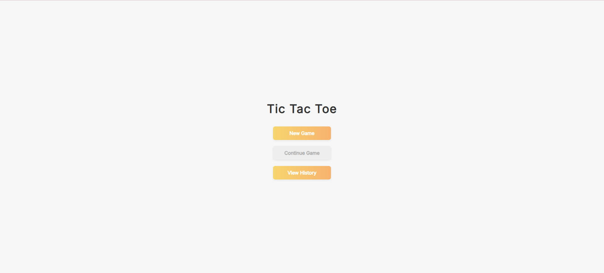
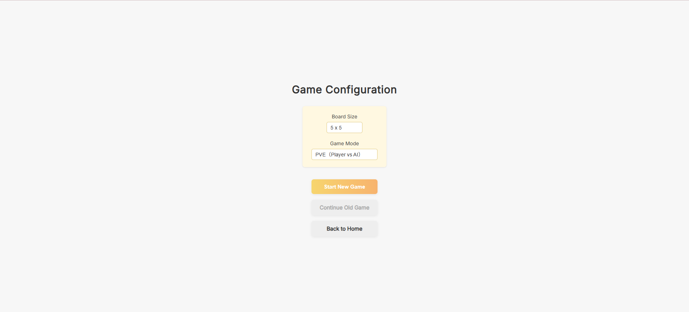
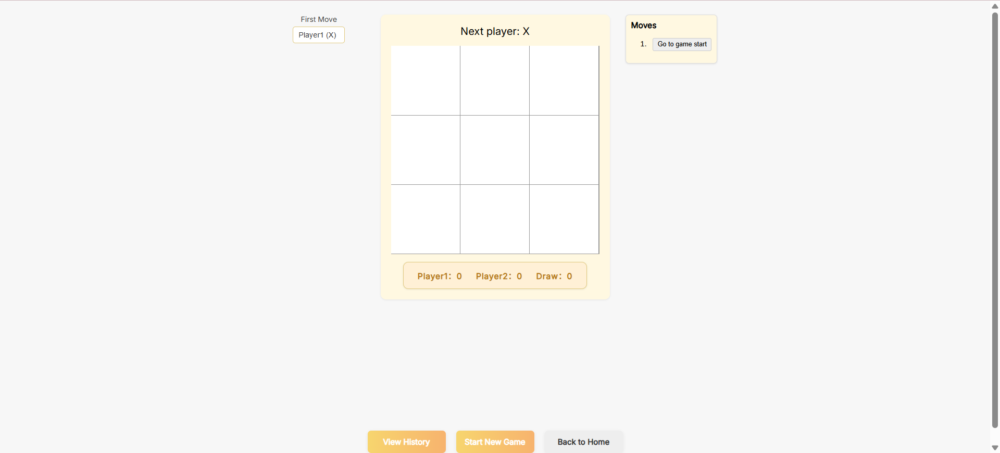
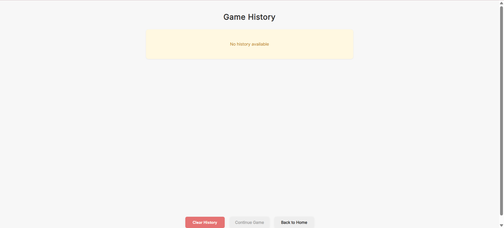
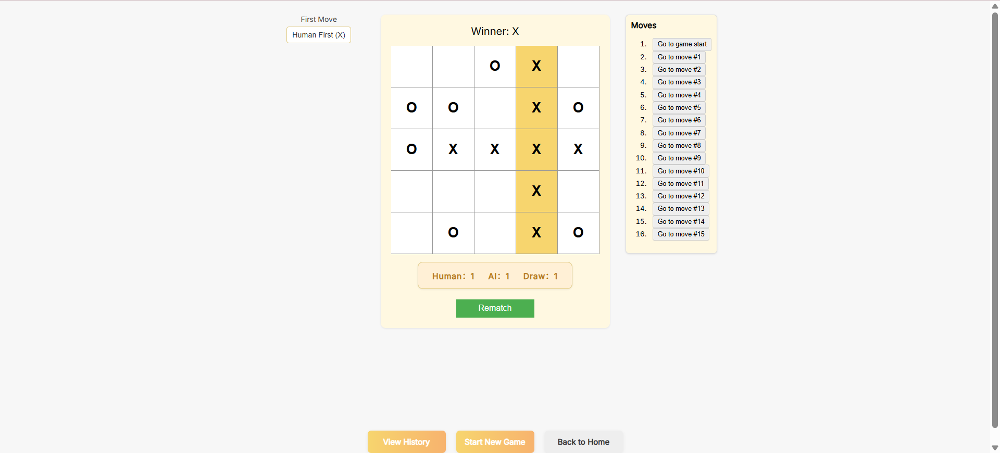
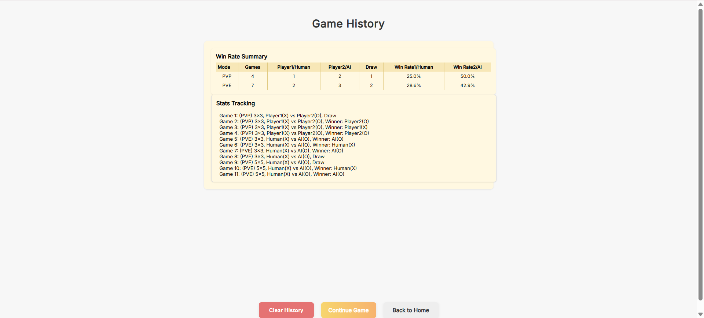

# 🧠 Tic-Tac-Toe – Enhanced React Implementation (v2.0)

A fully interactive and persistent Tic-Tac-Toe game built with **React**.  
This project demonstrates modern front-end development principles, including multi-page routing, state persistence, AI interaction, and responsive UI.

Designed and developed by **Zhu Kuangyun**, a telecommunications engineering student at INSA Lyon, as part of a personal initiative to deepen front-end skills and showcase interactive UI design.

---

## 🎮 Preview Screenshots

| Home Page | Config Page |
|-----------|-------------|
|  |  |

| Game Page | History Page |
|-----------|--------------|
|  |  |

| In-Game Example | Win Rate Summary |
|----------------|------------------|
|  |  |

---

## ✨ Full Feature List

### ✅ Core Features (v1.0)
- Classic **PVP (Player vs Player)** mode.
- **Victory detection** with line highlighting.
- **Draw detection** when no moves left.
- **Move history** with time-travel (go back to any step).
- **Rematch button** to restart easily.
- **Custom board size** from 3×3 to 8×8.
- Responsive UI and board scaling.

### 🆕 New in v2.0 (May 15–16, 2025)
- ✅ **Multi-Page Routing** (`react-router-dom`)
  - `/` Home | `/config` Config | `/game` Game | `/history` History
- ✅ **PVE mode**: play against a basic AI
- ✅ **First-move selection**: choose who plays first
- ✅ **Scoreboard**: track wins/draws across one config
- ✅ **Game history tracking**: stored and reviewed via History Page
- ✅ **Win Rate Summary table**
- ✅ **LocalStorage persistence**:
  - Save config, ongoing game, scores and history
  - Automatically restore after refresh
- ✅ **Continue Game button**:
  - Disabled if no progress; resumes current session if exists
- ✅ **Clear History button**:
  - Wipes all saved data from browser

---

## 🛠️ Development Process

This project evolved in **two major phases**:

### 🔹 Phase 1 – Core Build (v1.0)
> Completed prior to May 11, 2025  
- Game logic and UI built in a single component
- Implemented win/draw detection and time-travel history
- Introduced board resizing and basic styling

### 🔸 Phase 2 – Full Refactor & Feature Expansion (v2.0)
> Completed May 15–16, 2025 (overnight full refactor)  
- Converted to multi-page architecture (SPA → MPA)
- Broke down code into **Pages**, **Hooks**, **Utils** and **Components**
- Added **AI opponent** with simple strategy
- Introduced **state persistence** via LocalStorage
- Created **cross-page data flow** using props/hooks
- Refined UI for each view and added conditionally disabled buttons

---

## 🧩 Tech Stack

| Tool              | Purpose                                |
|-------------------|----------------------------------------|
| React + Vite      | UI & SPA Framework                     |
| React Router DOM  | Multi-page routing                     |
| JavaScript (Hooks)| Logic, state management                |
| localStorage API  | Persistent state saving                |
| Git & GitHub      | Version control                        |
| GitHub Copilot    | Code suggestions during development    |
| ChatGPT           | Debugging, architecture and strategy   |

> **Note**: Copilot and ChatGPT were used as development assistants, not replacements. All logic, structure, and integrations were independently planned and implemented.

---

## 📦 Installation & Usage

Follow these steps to set up and run the project locally:

```bash
# 1. Clone the repository
git clone https://github.com/NuageZHU/Tic-Tac-Toe.git
cd Tic-Tac-Toe

# 2. Install dependencies
npm install

# 3. Start the development server
npm run dev

# Open your browser at http://localhost:5173 to enjoy the game.
```

---

## 🧠 About the Developer

**Zhu Kuangyun** – 4th year engineering student, INSA Lyon (Telecommunications Department)  
This project is part of my personal portfolio, demonstrating interactive front-end application development and component-based architecture using React.

---

## 📜 License

This project is licensed under the MIT License. See the [LICENSE](./LICENSE) file for details.