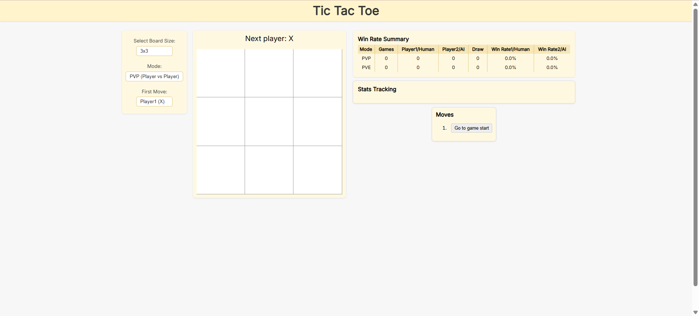

# 🧠 Tic-Tac-Toe – Enhanced React Implementation

This project is a responsive and interactive implementation of the classic Tic-Tac-Toe game using **React**. It includes key features such as dynamic board size selection, move history, and win/draw detection.

Developed by **Zhu Kuangyun** from INSA Lyon as a front-end response for a technical stage application.

---

## 🚀 Preview

### 📌 Initial State



### 🕹️ In-Game Example


---

## 🚀 Features

- ✅ **Two-player mode** with turn-based logic.
- ✅ **Victory detection** with winning line highlight.
- ✅ **Draw detection** when the board is full with no winner.
- ✅ **Rematch button** after each game.
- ✅ **Game history tracker** with move-by-move replay.
- ✅ **Display winner and draw result** in game history.
- ✅ **Custom board size support**: choose from 3×3, 4×4, 5×5 … up to 8×8.
- ✅ **Responsive UI** with clear layout and improved visuals.
- ✅ **Board scaling and styling** for different sizes.
- ✅ **"Stats Tracking"** with full past results listed.

---

## 📦 Installation & Usage

```bash
# 1. Clone the repository
git clone https://github.com/NuageZHU/Tic-Tac-Toe.git
cd your-repo-name

# 2. Install dependencies
npm install

# 3. Start the development server
npm run dev
